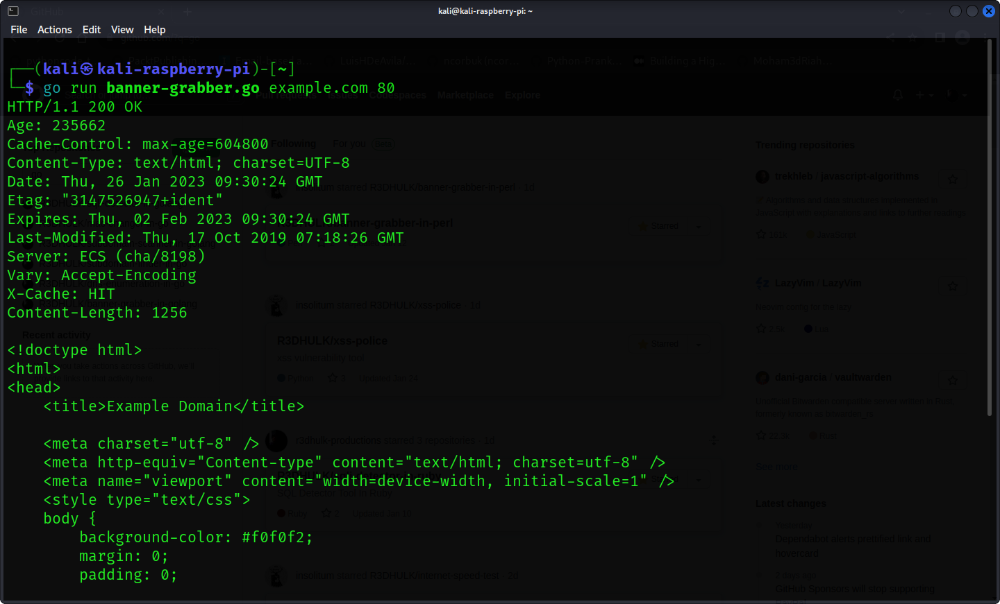

<h1><b>Banner Grabber In Go</b></h1>
<h1><b>What Is Banner Grabber?</b></h1>
<h2><i>Banner grabbing is a technique used to gain information about a computer system on a network and the services running on its open ports. Administrators can use this to take inventory of the systems and services on their network.</h1></i>

#
 </a>

#
<h2><b> 😇 Author: Sumalya Chatterjee </b></h2>

#
<h1><b>❤️ Don't Copy, Do Fork 😊</b></h1>

#
<h1><b>See What This Tool Usually Does 👇</b></h1>



#

<h1><b>Git Installation </h1></b>

```
# Install Git
sudo apt install git

# Install Go
sudo apt install golang

# Git Clone
git clone https://github.com/R3DHULK/banner-grabber-in-golang

# Change Directory
cd banner-grabber-in-golang

# Run This Tool To Grab Banner
go run banner-grabber.go <target domain name> <targetted port>

```
#
<h2><b><i> Show Support 👇👇👇</b></i> </h2>
<a href="https://www.buymeacoffee.com/r3dhulk"> </a><br><br>

